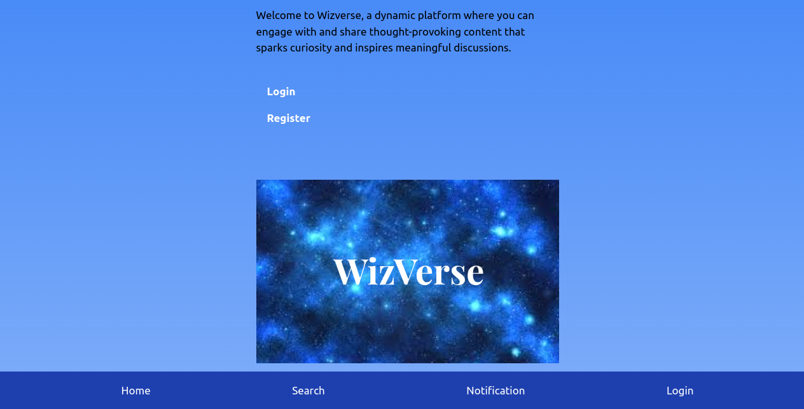

# Wizverse


## About the app

Wizverse is a social application where you can post your ideas or opinions.
Users can then Agree or Disagree with you.
Users can also comment on your post to provide their insight.


## Features

- User-friendly - Easy create an account and start posting.
- Secure - Uses django authentication system to ensure users fill in strong passwords.
- Posts - Easily create posts and share with fellow users.
- Agree with people - Agree with people who share like minded opinions and ideas you resonate strongly with.
- Disagree with people - Disagree with ideas and opinion you feel are out of bounds.

## Account Setup

To create an account you will need to provide the following details

- Username
- Email
- Strong Password

## Technologies used
- Python - Programming Language
- Django - Framework used
- PostgreSQL - Database Used
- Tailwind CSS - Styling
- Javascript - Increase dynamics.

## Project setup
1. start a virtualenvironment

   ``` python3 -m venv myenv```
    
    ```source myenv/bin/activate```

2. Clone the project

    ```git clone <url>```

3. Install the dependencies in requirements.txt file

   ``` pip install -r requirements.txt```

4. Continue.


## Image snippets




